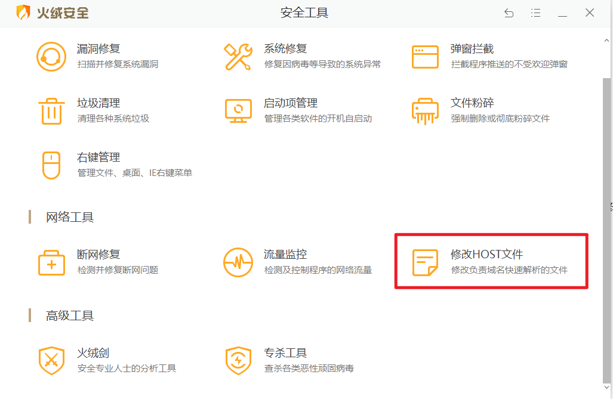

+++
date = "2025-12-04 18:03:29"
lastmod = "2025-12-05 10:49:19"
draft = false
title = "Adobe软件屏蔽弹窗"
+++

1. 卸载（AGS）Adobe Genuine Service 

2. 代理软件添加以下规则：  
```yml
- 'DOMAIN-SUFFIX,Adobe.io,REJECT'
- 'DOMAIN-SUFFIX,Adobestats.io,REJECT'
``` 

3.火绒拦截
网络防护>自定义规则：   
```yml
*.Adobe.io  
*.Adobestats.io 
```  
 

4. hosts域名屏蔽
```yml
127.0.0.1 adobe.io
127.0.0.1 adobestats.io
``` 
 