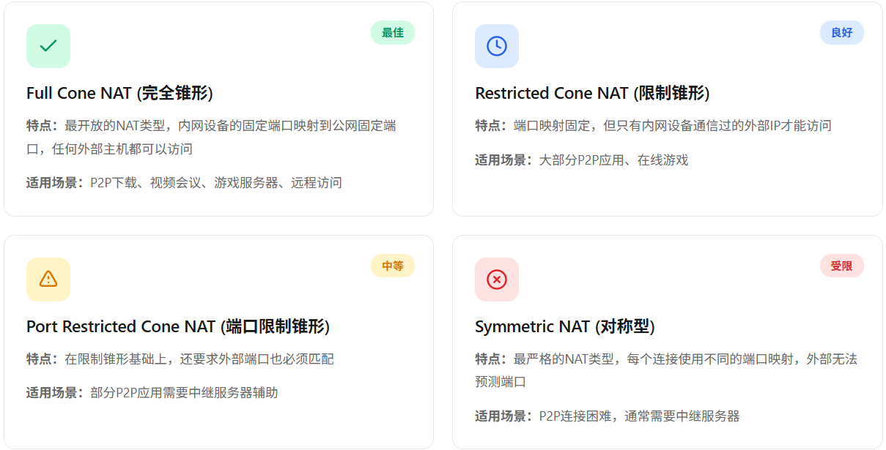
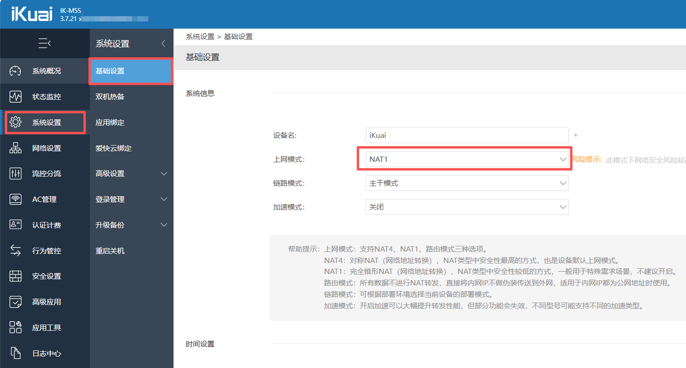
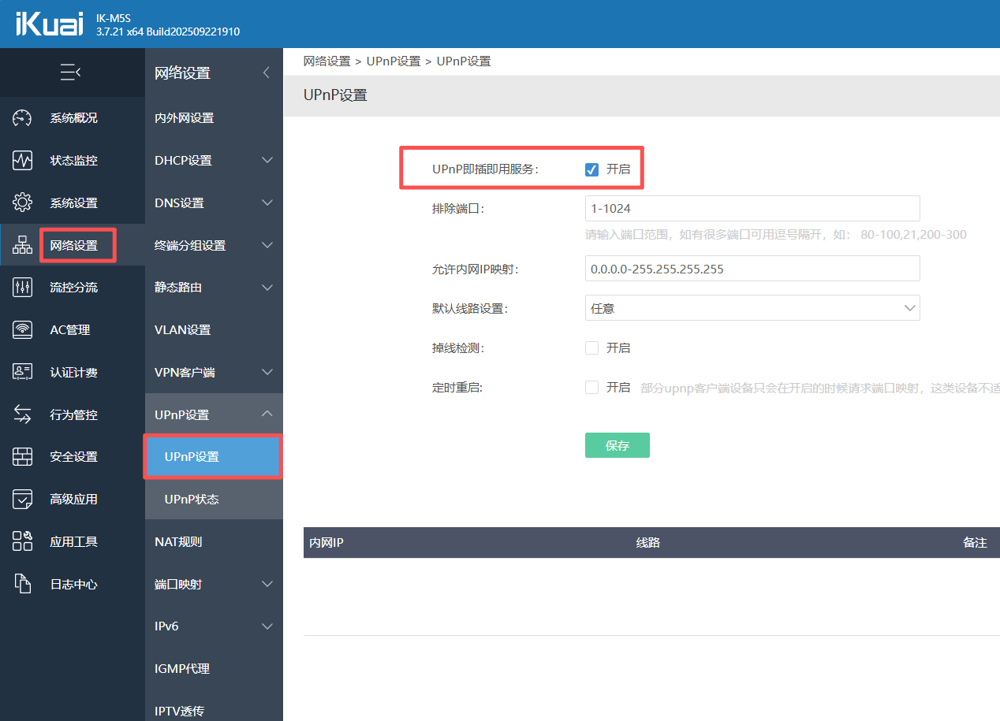
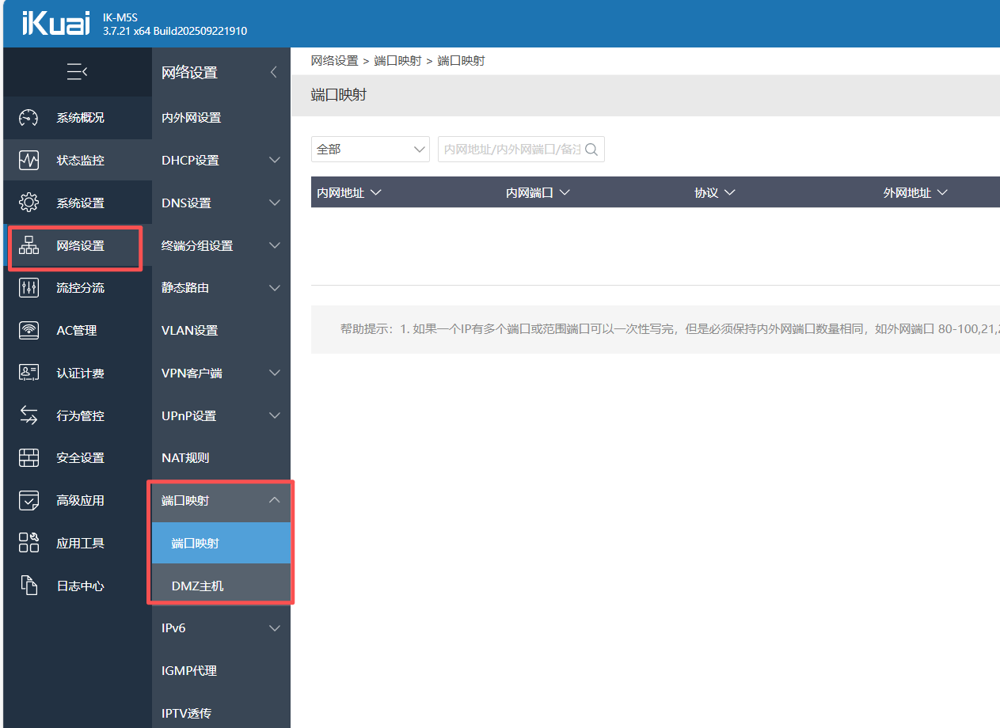
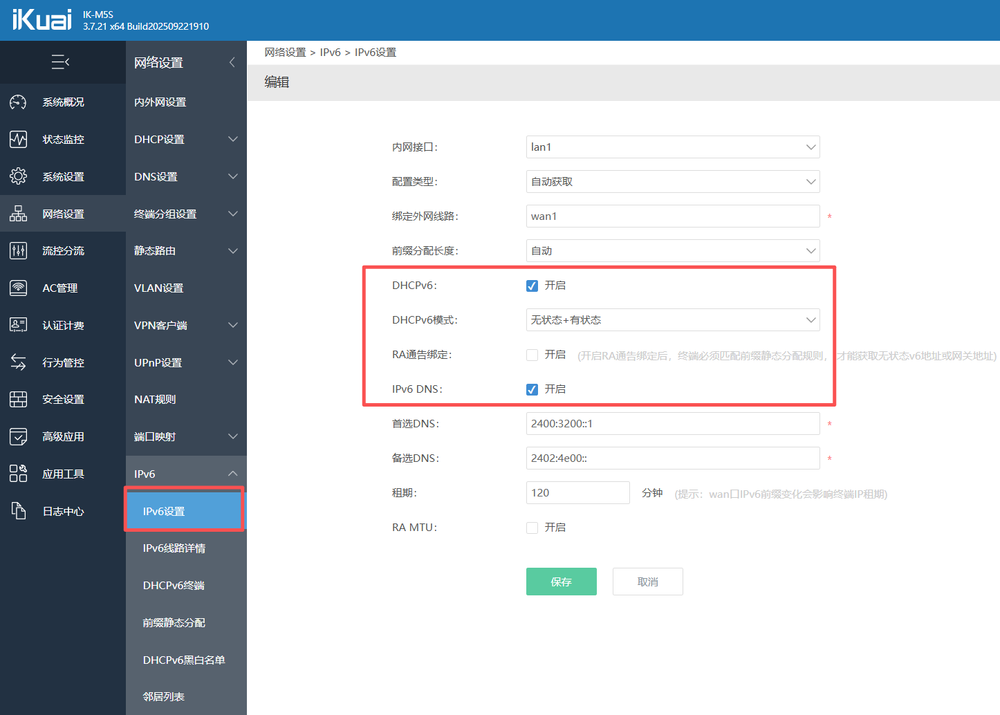

+++
date = "2026-01-06"
lastmod = "2025-12-30T14:31:02+08:00"
toc = "true"
title = "NAT地址转换"

+++

### 什么是NAT？

NAT (Network Address Translation) 网络地址转换，是一种让多个内网设备共享一个公网IP的技术。路由器会将内网IP转换为公网IP，使得内网设备可以访问互联网。

NAT技术虽然在一定程度上解决了IPv4地址短缺的问题，却破坏了点到点P2P（Point to Point）网络的通信。因为在P2P网络中要求通信双方都能主动发起访问，而NAT设备的存在却阻断了这种主动访问。

#### 即时检测您的 NAT 类型

- [NAT Checker - 免费检测工具](https://natchecker.com/zh/)
- [NAT类型在线检测工具 – 猫点饭](https://mao.fan/mynat)	
- [端口扫描工具 - 云上工具](https://yunshangtool.cn/port-scanner/)
- [NAT类型检测工具 - 17NAS](https://17nas.com/nat-test.php)

#### NAT 如何改善：

1. 本机直接拨号，或者静态公网IP(无NAT)
2. 路由器拨号：
   - 类型选择NAT1（完全锥形NAT）推荐✅
   - UPnP（自动端口转发）推荐✅
   - 端口映射（指定映射出去的端口）推荐✅
   - 开启IPv6（无NAT，对方也必须支持IPv6!）推荐✅
   - DMZ（将一个内网设备完全暴露到公网）谨慎💥
   - [STUN隧道穿越](https://info.support.huawei.com/info-finder/encyclopedia/zh/STUN.html)（Tailscale，ZeroTier，EasyTier，节点小宝等）
   - [VPN虚拟专用网](https://info.support.huawei.com/info-finder/encyclopedia/zh/VPN.html)（PPTP,IPsec,Wireguard,Openvpn等）	

---

参考资料	
> https://developer.aliyun.com/article/1662654	
> https://info.support.huawei.com/info-finder/encyclopedia/zh/NAT.html