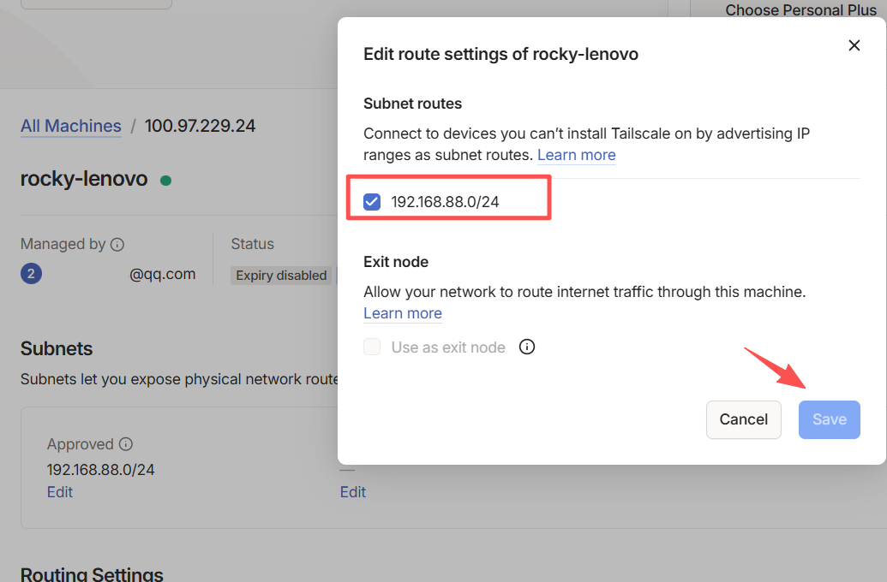
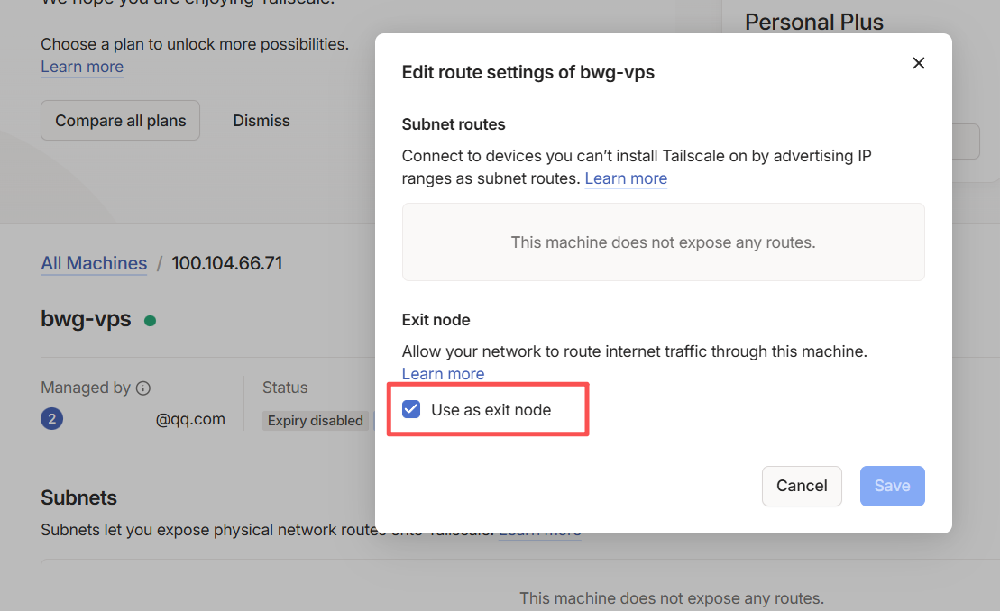

+++
date = "2025-12-30T14:31:02+08:00"
lastmod = "2025-12-30T14:31:02+08:00"
toc = "true"
title = "Tailscale组网"

+++

# 什么是Tailscale？

[Tailscale](https://tailscale.com)是一个基于[Wireguard](https://www.wireguard.com/)构建的现代VPN。 它在计算机内部之间创建了一个的[叠加网络](https://tailscale.com/blog/how-tailscale-works/)，然后通过[NAT穿越](https://tailscale.com/blog/how-nat-traversal-works/)实现设备的全互联，WireGuard®让网络变得简单。

[在线控制面板](https://login.tailscale.com/admin/machines) | [软件下载](https://tailscale.com/download/linux) | [离线安装包](https://pkgs.tailscale.com/stable/#static) | [Docker镜像](https://hub.docker.com/r/tailscale/tailscale) | [更新日志](https://tailscale.com/changelog#client)

```
Linux发型版安装脚本
curl -fsSL https://tailscale.com/install.sh | sh
安装后运行此命令，复制链接登录账号
tailscale up --accept-dns=false
```

-------------------------------------------------------------------------------------

## 2. [Subnet routers子网路由(扩展Tailscale网络)](https://tailscale.com/kb/1019/subnets)	

*子网路由器提供对特定私有子网的访问。它们使尾网设备能够访问这些子网内的非Tailscale设备，但不影响互联网流量路由。如果你需要访问像办公局域网或云VPC这样的私有网络，子网路由器是合适的解决方案。*

​	2.1 Linux启用IP转发

```bash
echo 'net.ipv4.ip_forward = 1' | tee -a /etc/sysctl.d/99-tailscale.conf
echo 'net.ipv6.conf.all.forwarding = 1' | tee -a /etc/sysctl.d/99-tailscale.conf
sysctl -p /etc/sysctl.d/99-tailscale.conf
```

​	2.2 [广告子网路由](https://tailscale.com/kb/1019/subnets#advertise-subnet-routes)

启用IP转发后，通过`--advertise-routes`设置子网路由表。逗号分隔添加多个子网。

```bash
tailscale set --advertise-routes=192.0.2.0/24,198.51.100.0/24
```

​	2.3 [在管理控制台启用子网路由](https://tailscale.com/kb/1019/subnets#enable-subnet-routes-from-the-admin-console)




​	2.4 在控制面板可以看到该设备被标记为<span style="background-color: lightblue; color: black;">Subnets</span>，然后在其它Linux客户端允许访问

```bash
tailscale up --accept-routes
```

​	2.5 测试连通性`ping 192.168.88.1`


## 3. [Exit nodes出口节点](https://tailscale.com/kb/1103/exit-nodes)（代理流量）  

*你可以通过在网络上设置一个设备作为出口节点，然后配置其他设备通过该节点传输流量，所有流量都经过该节点转发，可以实现IP伪装或者代理的作用。*

​	3.1 Linux启用IP转发

```bash
echo 'net.ipv4.ip_forward = 1' | tee -a /etc/sysctl.d/99-tailscale.conf
echo 'net.ipv6.conf.all.forwarding = 1' | tee -a /etc/sysctl.d/99-tailscale.conf
sysctl -p /etc/sysctl.d/99-tailscale.conf
```
​	3.2 设置VPS为Exit Node

```bash
tailscale set --advertise-exit-node && \
tailscale up --accept-dns=false
```
​	3.3 在管理控制台允许此设备为出口节点，然后可以看到该设备被标记为<span style="background-color: lightblue; color: black;">Exit Node</span>



​	3.4 其他客户端通过VPS转发流量,并且允许访问本地网络

```bash
tailscale set --exit-node=100.104.66.71 --exit-node-allow-lan-access=true
```
​	3.5 停止使用出口节点，且重载配置	

```bash
tailscale set --exit-node= && \
tailscale up --reset --accept-dns=false --accept-routes
```
#### 其它开源参考
> [GitHub - juanfont/headscale：Tailscale 控制服务器的开源自架设实现](https://github.com/juanfont/headscale)